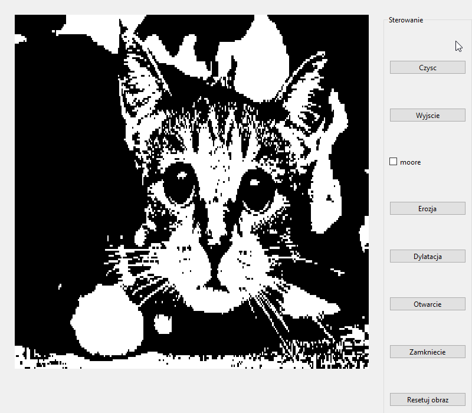

# Graphic Transformations

This repository contains various image processing programs developed using **Qt** and **C++**. The programs demonstrate different types of graphic transformations, such as 2D operations, 3D operations, B-spline, color models, morphological operations, and others. Each program showcases the transformation process through visualizations captured in GIFs for certain operations.

## Table of Contents
1. [2D Transformations](#2d-transformations)
2. [3D Transformations](#3d-transformations)
3. [B-Spline](#b-spline)
4. [Color Models](#color-models)
5. [Morphological Operations](#morphological-operations)
6. [Flood Fill](#flood-fill)
7. [Ellipse and Circle](#ellipse-and-circle)
8. [Line Drawing](#line-drawing)
9. [Scanline Algorithm](#scanline-algorithm)
10. [Getting Started](#getting-started)
11. [License](#license)

## 2D Transformations
In this section, 2D geometric transformations are applied to an image, such as scaling, rotation, and translation. These operations manipulate the image coordinates to transform its geometry in various ways.

### Example of 2D Transformation
This example demonstrates how scaling, rotation, and translation are applied to an image. The program allows users to interactively apply transformations and observe the changes in real-time.

## 3D Transformations
This section deals with 3D transformations, including scaling, rotation, and translation in three-dimensional space. These transformations are used to manipulate the geometry of 3D objects or images (including scaling, rotation, and translation).

## B-Spline
B-Spline is a curve fitting and interpolation method commonly used in graphic modeling and image processing. It provides smooth and flexible curves through a series of control points.

### Example of B-Spline Transformation
This example demonstrates the application of the B-spline algorithm to smooth and interpolate data points, creating a smooth curve through the set of control points.

## Color Models
Color models are mathematical representations of colors in digital images. In this section, different color spaces such as RGB, CMYK, and HSL are explored, providing insight into how colors are represented in digital media.

### Example of Color Models Transformation
This section shows the transformation of an image as it is converted between different color models, allowing for better manipulation of color data for tasks like image enhancement or color correction.

## Morphological Operations
Morphological operations are techniques used in image processing to extract image components useful in the representation and description of shape. Common operations include dilation, erosion, opening, and closing.

### Example of Morphological Operations
The GIF shows the application of morphological transformations like dilation and erosion to emphasize or reduce certain features in the image. This is particularly useful in image segmentation and feature extraction tasks.

## Flood Fill
The Flood Fill algorithm is used to fill a region of an image with a specific color. It is commonly used in computer graphics for tasks like coloring bounded regions in a bitmap or performing region-growing operations.

### Example of Flood Fill
This section demonstrates how the Flood Fill algorithm is used to fill a closed boundary within an image with a specific color, useful for tasks like object segmentation.

## Ellipse and Circle
This section includes algorithms that work with ellipses and circles, including drawing, transforming, and manipulating these shapes in images.

## Line Drawing
The Line Drawing algorithm focuses on efficient ways to draw lines between two points. It covers techniques such as Bresenham's line algorithm for raster graphics.

## Scanline Algorithm
The Scanline algorithm is widely used in computer graphics for tasks like filling polygons, removing hidden surfaces, and performing shading in raster graphics.

## Getting Started

### Prerequisites
To run the project, make sure you have the following software installed:
- **Qt** (Version X.X)
- **C++ Compiler** (GCC, Clang, or Visual Studio)
- **CMake** (Version X.X)

### Installation
Clone the repository to your local machine:
git clone https://github.com/your_username/GraphicTransformations.git

Navigate to the project directory:
cd GraphicTransformations

Build the project:
mkdir build cd build cmake .. make

### Running the Programs
After building the project, you can run any of the individual programs. For example, to run the 2D transformation program, execute the following command:
./2DTransformation

## License
Copyright (c) 2022 [Wiktoria Chojnacka]
